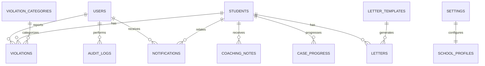
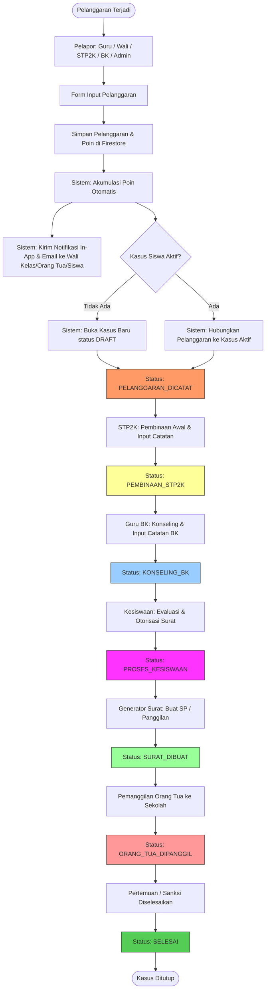
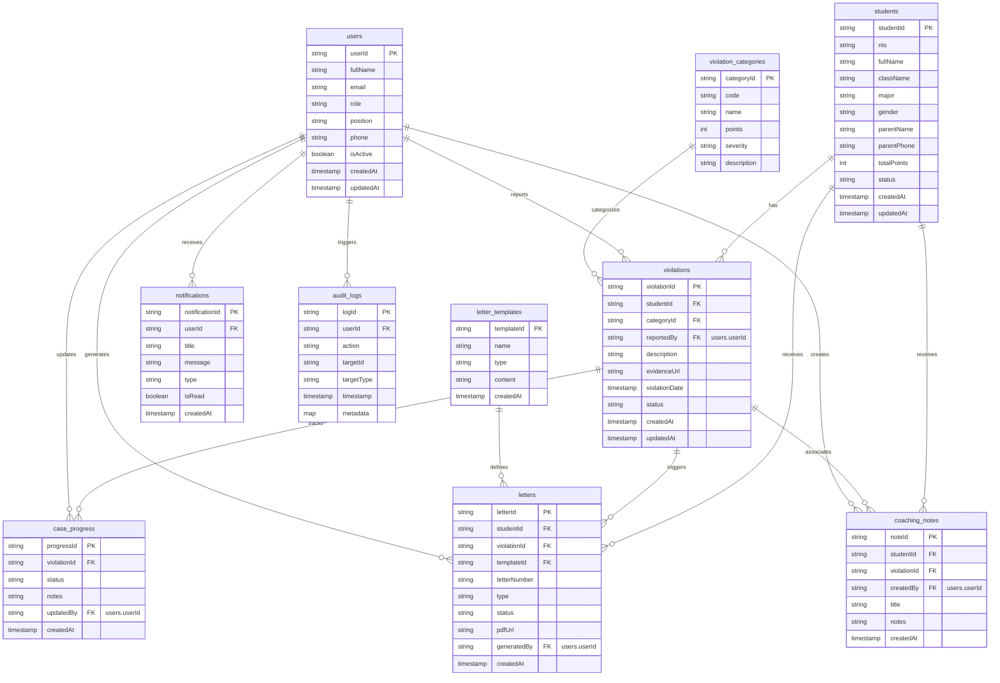

<aside>
📄

**Product Requirements Document (PRD)**

E-Report Siswa SMK Texmaco

Versi: 1.0 (MVP)

Status: Draft

</aside>

## 1. Ringkasan Produk

### 1.1 Latar Belakang

Proses pencatatan pelanggaran siswa saat ini masih manual (buku pelanggaran, dokumen fisik, komunikasi tersebar). Dampaknya:

- Riwayat pelanggaran sulit ditelusuri
- Perhitungan poin manual dan rawan salah
- Surat peringatan lama dibuat
- Monitoring kasus kurang terstruktur
- Orang tua terlambat menerima informasi

E-Report hadir sebagai sistem digital terintegrasi untuk mengelola pelanggaran siswa, pembinaan/konseling, surat resmi, notifikasi, dan pelaporan secara terpusat.

### 1.2 Target Platform

- Web application (responsive)

### 1.3 Target Pengguna (Role)

- Admin
- Guru BK
- STP2K
- Wali Kelas
- Kesiswaan
- Orang Tua
- Siswa

## 2. Tujuan Produk (Product Goals)

- **G1:** Mempercepat proses pencatatan pelanggaran siswa
- **G2:** Mengotomatisasi akumulasi poin pelanggaran
- **G3:** Mempermudah monitoring perkembangan kasus siswa (timeline + status)
- **G4:** Mengurangi pekerjaan administratif melalui generator surat otomatis
- **G5:** Meningkatkan transparansi komunikasi antara sekolah, siswa, dan orang tua
- **G6:** Menyediakan laporan pelanggaran secara real-time

## 3. Metrik Keberhasilan (Success Metrics)

| Metric | Target |
| --- | --- |
| Waktu input pelanggaran | &lt; 2 menit |
| Pembuatan surat | &lt; 1 menit |
| Akurasi perhitungan poin | 100% |
| Riwayat kasus terdokumentasi | 100% |
| Pengiriman notifikasi setelah event | &lt; 30 detik |
| Export laporan | &lt; 10 detik |

## 4. Ruang Lingkup

### 4.1 MVP Scope (Included)

- Login/Logout + Session management
- Dashboard
- Manajemen Data Siswa (daftar, detail, riwayat)
- Manajemen Pelanggaran (tambah, edit, detail, evidence)
- Sistem Poin (akumulasi otomatis + monitoring)
- Pembinaan & Konseling (catatan + tindak lanjut)
- Tracking Kasus (status, timeline, log aktivitas)
- Generator Surat (SP1/SP2/SP3, Perjanjian, Panggilan Orang Tua, dan surat lain)
- Notifikasi (minimal in-app + email)
- Export PDF (surat & laporan) dan Export Excel (laporan)

### 4.2 Out of Scope (Excluded)

- Mobile app (Android/iOS)
- Multi-school support (SaaS)
- Integrasi Dapodik
- AI Assistant (Phase 2)
- Digital signature (Phase 2)
- OCR surat (Phase 2)

### 4.3 Keputusan Scope yang Perlu Difinalkan (Open Decision)

- **Notifikasi WhatsApp:** kebutuhan Anda mencantumkan WhatsApp, namun scope awal menyebut “WhatsApp Gateway” excluded dari MVP. Opsi:
    - **Opsi A (disarankan untuk konsisten dengan scope awal):** WhatsApp masuk Phase 2 (MVP: in-app + email)
    - **Opsi B:** WhatsApp masuk MVP (butuh provider/gateway + biaya + compliance)

## 5. Asumsi & Definisi

### 5.1 Definisi “Case”

- **1 case per siswa (berkelanjutan)**: seluruh rangkaian pelanggaran, pembinaan, konseling, keputusan, dan surat terkait siswa dikelola dalam satu timeline kasus yang terus berjalan (dengan penanda periode/semester bila diperlukan).

### 5.2 Struktur Akademik

- Struktur: **Kelas + Jurusan** (contoh jurusan: **RPL**, **TEI**)

### 5.3 Master Kategori Pelanggaran

- Kategori pelanggaran dan poin adalah **master data** yang **dapat diubah oleh Admin**.

## 6. Stakeholder

- Product Owner: SMK Texmaco
- Stakeholder internal: Kesiswaan, Guru BK, STP2K, Wali Kelas, Admin sekolah
- Stakeholder eksternal: Orang Tua, Siswa

## 7. User Roles & Hak Akses (RBAC)

### 7.1 Deskripsi Role

- **Admin:** mengelola sistem, master data, user, konfigurasi.
- **Guru BK:** konseling/pembinaan lanjutan, rekomendasi tindakan.
- **STP2K:** pembinaan awal terhadap pelanggaran.
- **Wali Kelas:** monitoring siswa pada kelas yang diampu.
- **Kesiswaan:** menentukan tindakan lanjutan dan keputusan kasus, otorisasi surat tertentu.
- **Orang Tua:** memantau pelanggaran/poin/surat/notifikasi anak.
- **Siswa:** melihat pelanggaran/poin/surat/notifikasi pribadi.

### 7.2 RBAC Matrix (Draft)

| Modul | Aksi | Admin | STP2K | Guru BK | Wali Kelas | Kesiswaan | Orang Tua | Siswa |
| --- | --- | --- | --- | --- | --- | --- | --- | --- |
| Auth | Login/Logout | ✓ | ✓ | ✓ | ✓ | ✓ | ✓ | ✓ |
| Data Siswa | Lihat daftar/detail | ✓ | ✓ | ✓ | ✓ (kelasnya) | ✓ | ✓ (anak) | ✓ (diri) |
| Data Siswa | Buat/Edit siswa | ✓ | - | - | - | - | - | - |
| Pelanggaran | Tambah | ✓ | ✓ | ✓ | ✓ | ✓ | - | - |
| Pelanggaran | Edit/Hapus | ✓ | Opsional | Opsional | Opsional | ✓ | - | - |
| Pembinaan/Konseling | Tambah catatan | ✓ | ✓ | ✓ | - | ✓ | - | - |
| Kasus | Ubah status | ✓ | ✓ (tahap STP2K) | ✓ (tahap BK) | - | ✓ (final) | - | - |
| Surat | Generate/Export | ✓ | - | ✓ | - | ✓ | Lihat/Unduh | Lihat/Unduh |
| Notifikasi | Terima | ✓ | ✓ | ✓ | ✓ | ✓ | ✓ | ✓ |
| Laporan | Lihat/Export | ✓ | ✓ | ✓ | ✓ | ✓ | - | - |

## 8. Kebutuhan Fungsional (Functional Requirements)

## Module A — Authentication & Authorization

### A.1 Fitur

- Login
- Logout
- Session management
- Role-Based Access Control (RBAC)

### A.2 Acceptance Criteria

- Pengguna hanya dapat mengakses fitur sesuai role.
- Session berakhir otomatis ketika token kadaluarsa.
- Akses data dibatasi: orang tua hanya dapat melihat data anak; siswa hanya data pribadi; wali kelas hanya kelas yang diampu.

### A.3 Edge Cases

- Akun non-aktif/di-ban tidak dapat login.
- Jika role berubah, hak akses berubah tanpa perlu login ulang (maksimal berlaku pada refresh token berikutnya atau setelah reload).

## Module B — Student Management

### B.1 Fitur

- Daftar siswa
- Detail siswa
- Profil siswa
- Riwayat pelanggaran
- Riwayat pembinaan/konseling
- Riwayat surat

### B.2 Pencarian & Filter

- Nama
- NIS
- Kelas
- Jurusan (RPL/TEI)

### B.3 Acceptance Criteria

- Pencarian mengembalikan hasil dalam ≤ 2 detik untuk 5.000 siswa.
- Detail siswa menampilkan ringkasan: total poin, status kasus terakhir, pelanggaran terbaru, surat terbaru.

## Module C — Violation Management

### C.1 Fitur

- Tambah pelanggaran
- Edit pelanggaran
- Detail pelanggaran
- Upload bukti (foto/dokumen)
- Riwayat pelanggaran

### C.2 Field Pelanggaran (Minimal)

- Student (relation)
- Category (relation/select)
- Description (text)
- Evidence (file)
- Reported By (user)
- Date (datetime/date)
- Points (number, derived dari category)

### C.3 Rules

- Saat pelanggaran dibuat: sistem otomatis mengisi **Points** sesuai kategori.
- Evidence tersimpan di Firebase Storage dan direferensikan di Firestore.

### C.4 Acceptance Criteria

- Sistem otomatis menambahkan poin berdasarkan kategori.
- Validasi: Student & Category wajib diisi.
- Upload bukti mendukung minimal JPG/PNG/PDF dengan limit ukuran sesuai kebijakan (dicatat di settings).

## Module D — Point System

### D.1 Fitur

- Akumulasi poin otomatis
- Rekap poin siswa
- Monitoring batas poin

### D.2 Rules (Core)

- Saat pelanggaran dibuat: `TotalPointsSiswa += PoinKategori`
- Saat pelanggaran dihapus: `TotalPointsSiswa -= PoinKategori`

### D.3 Aturan Batas Poin → Dampak ke Kasus

- Saat `TotalPointsSiswa` melewati threshold tertentu, sistem **otomatis mengubah status kasus**.
- Perubahan otomatis tetap tercatat di audit log dan case timeline.

## Module E — Coaching Management (Pembinaan & Konseling)

### E.1 Fitur

- Catatan pembinaan
- Catatan konseling
- Tindak lanjut (follow-up)

### E.2 Acceptance Criteria

- Setiap pembinaan/konseling tersimpan pada timeline kasus (case_progress).
- Catatan dapat dilampiri dokumen (opsional) sesuai kebijakan.

## Module F — Case Tracking

### F.1 Fitur

- Tracking status kasus
- Timeline kasus per siswa
- Log aktivitas

### F.2 Workflow Status (MVP)

DRAFT → PELANGGARAN_DICATAT → PEMBINAAN_STP2K → KONSELING_BK → PROSES_KESISWAAN → SURAT_DIBUAT → ORANG_TUA_DIPANGGIL → SELESAI

### F.3 Acceptance Criteria

- Semua perubahan status tercatat pada log aktivitas (who/when/from/to).
- Timeline menampilkan event: pelanggaran, pembinaan, konseling, perubahan status, surat dibuat, panggilan orang tua.

## Module G — Letter Generator

### G.1 Surat yang Didukung (MVP)

- Surat Peringatan: **SP1, SP2, SP3**
- Surat Perjanjian
- Surat Panggilan Orang Tua
- Surat Lain (bebas, template flexible)

### G.2 Fitur

- Generate surat dari template
- Nomor surat otomatis
- Export PDF
- Arsip surat (riwayat + status)

### G.3 Penomoran Surat (Pola)

- Nomor surat otomatis memuat **kode unit/SMK**.
- Contoh pola (placeholder):

`{no_urut}/{kode_unit}/SMK-TEX/{bulan_romawi}/{tahun}`

### G.4 Acceptance Criteria

- Nomor surat unik per jenis surat/periode (aturan final dicatat di settings).
- PDF dapat diunduh dan dicetak.
- Surat yang sudah final tidak dapat diubah tanpa audit trail (versi/riwayat).

## Module H — Notification System

### H.1 Trigger

- Pelanggaran baru
- Status kasus berubah
- Surat dibuat
- Orang tua dipanggil

### H.2 Recipient

- Guru BK, Wali Kelas, STP2K, Kesiswaan, Orang Tua, Siswa (sesuai event)

### H.3 Channel

- In-app (bell + list)
- Email
- WhatsApp (tergantung keputusan scope MVP vs Phase 2)

### H.4 Acceptance Criteria

- Notifikasi muncul maksimal **30 detik** setelah event terjadi (in-app).
- Email terkirim maksimal **30 detik–5 menit** setelah event (best effort, tergantung provider).
- Jika WhatsApp diaktifkan: pesan terkirim best effort dan kegagalan tercatat (retry + log).

## Module I — Reporting & Analytics

### I.1 Fitur Laporan

- Rekap Harian
- Rekap Bulanan
- Rekap Semester
- Export PDF
- Export Excel

### I.2 Statistik

- Pelanggaran terbanyak
- Kategori terbanyak
- Siswa dengan poin tertinggi
- Grafik tren pelanggaran

### I.3 Filter

- Rentang tanggal
- Kelas
- Jurusan (RPL/TEI)
- Kategori pelanggaran

### I.4 Acceptance Criteria

- Export laporan selesai ≤ 10 detik (untuk data dalam batas wajar).
- Laporan konsisten dengan data transaksi (no double count).

## Module J — AI Assistant (Phase 2)

### J.1 Fitur (Roadmap)

- Ringkasan kasus otomatis
- Rekomendasi tindakan
- Analisis pola pelanggaran
- Draft surat otomatis

### J.2 Batasan

- AI tidak boleh mengambil keputusan final; keputusan tetap oleh pihak sekolah.

## 9. Kebutuhan Non-Fungsional (NFR)

### 9.1 Performance

- Response time API/UI: **< 2 detik**
- Dashboard load: **< 3 detik**

### 9.2 Security

- Firebase Authentication
- RBAC (server-side enforcement via rules/Cloud Functions)
- Audit log untuk aktivitas penting
- HTTPS

### 9.3 Availability

- Uptime target: **99%**

### 9.4 Scalability

Mendukung minimal:

- 5.000 siswa
- 50.000 pelanggaran
- 100 pengguna aktif

## 10. Audit Log Requirements

### 10.1 Aktivitas yang Wajib Dicatat

- Login
- Tambah pelanggaran
- Edit pelanggaran
- Hapus pelanggaran
- Update status kasus
- Generate surat
- Export laporan

### 10.2 Field Minimal

- userId
- action
- targetId
- targetType
- timestamp
- metadata (opsional: from/to status, nilai poin, reason, dsb.)

## 11. Desain Database (High-Level Firestore Collections)

- users
- students
- violations
- violation_categories
- coaching_notes
- case_progress
- letters
- letter_templates
- notifications
- audit_logs
- settings
- school_profiles

## 12. Rekomendasi Tech Stack

### Frontend

- Next.js 15
- TypeScript
- Tailwind CSS
- Shadcn UI

### Backend & Infra

- Firebase Authentication
- Firestore
- Firebase Storage
- Firebase Cloud Functions

### Dokumen / PDF

- React PDF / PDF Generator

### Deployment & Monitoring

- Vercel / Firebase Hosting
- Firebase Analytics
- Firebase Crashlytics

## 13. Definisi Rilis (Release Definition)

Rilis dianggap siap jika:

- Semua fitur MVP selesai
- Tidak ada bug kritikal
- Role permission berjalan sesuai matrix
- PDF dapat dihasilkan dan diunduh
- Export laporan berfungsi (PDF/Excel)
- Tracking kasus berjalan end-to-end
- UAT sekolah selesai

## 14. Lampiran

### 14.1 Diagram Data (Konseptual)



# Rencana Implementasi Frontend — E-Report Siswa SMK Texmaco

Dokumen ini berisi rencana implementasi frontend terperinci untuk aplikasi **E-Report Siswa SMK Texmaco**. Fokus utama dari rencana ini adalah arsitektur antarmuka (UI/UX), struktur navigasi berbasis peran (RBAC), alur sistem (Flowcharts & Mermaid), dan rancangan visual layout (*ASCII Wireframes*).

---

## 1. Strategi & Panduan UI/UX

Untuk menciptakan impresi pertama yang profesional dan premium (modern academic dashboard), kami mengadopsi standar desain berikut:

### 1.1 Palet Warna & Tipografi

- **Typography:** Menggunakan font **Outfit** atau **Inter** dari Google Fonts untuk kejelasan membaca (readability) data numerik dan nama siswa.
- **Color Tokens (HSL Harominous Palette):**
    - **Primary (Teal):** `#0F766E` (`hsl(172, 77%, 26%)`) — Melambangkan ketenangan, akademik, dan profesionalisme.
    - **Accent (Mint):** `#14B8A6` (`hsl(172, 66%, 50%)`) — Untuk elemen interaktif, hover, dan highlight.
    - **Background Light:** `#F8FAFC` (`hsl(210, 40%, 98%)`) — Bersih dan terang.
    - **Background Dark (Slate):** `#0F172A` (`hsl(222, 47%, 11%)`) — Mode gelap yang sleek.
    - **Success (Green):** `#16A34A` — Penanda kasus selesai / poin berkurang / pembinaan sukses.
    - **Warning (Amber):** `#F59E0B` — Peringatan batas poin rendah / SP1.
    - **Danger (Red):** `#DC2626` — Pelanggaran berat / akumulasi poin tinggi / SP3.

### 1.2 UX Micro-Interactions & Premium Design

- **Glassmorphism:** Digunakan pada topbar (`backdrop-blur-md bg-white/70` atau `bg-slate-900/70`) untuk kesan modern.
- **Sidebar & Card Transitions:** Animasi halus pada transisi menu (`transition-all duration-300 ease-in-out`), hover scale pada dashboard widget.
- **Skeleton Loading:** Penggunaan state loading berbasis skeleton (`Shadcn Skeleton`) daripada spinner biasa untuk transisi data yang lebih smooth saat fetch via TanStack Query.
- **Empty States:** Menggunakan ilustrasi bersih yang dibuat responsif (SVG minimalis) dengan tombol Call-to-Action (CTA) yang jelas saat data kosong.

### 1.3 Strategi Mobile-First & Responsif

- **Hamburger Navigation:** Sidebar meluncur dari samping (*slide-over drawer*) pada resolusi mobile (< 768px).
- **Responsive Tables:** Tabel data siswa/pelanggaran akan diubah menjadi format *card list* pada resolusi mobile untuk menghindari *horizontal scroll* yang mengganggu.
- **Split Screens (Desktop Only):** Pada halaman Generator Surat dan Kasus Detail, layout menggunakan pembagian 2 kolom (Kiri: Form kontrol, Kanan: Preview PDF / Timeline detail) yang secara otomatis menumpuk menjadi 1 kolom vertikal di mobile.

---

## 2. Peta Navigasi & Arsitektur Rute (Mermaid)

Navigasi diatur secara ketat menggunakan **Role-Based Access Control (RBAC)** di sisi frontend dengan memanfaatkan route guard.

```mermaid
graph TD
  %% Rute Publik %%
  Login["/login (Public)"]
  ForgotPassword["/forgot-password (Public)"]
  Unauthorized["/unauthorized (Public)"]

  %% Shell Layangan Utama %%
  AppShell["App Layout (Sidebar + Topbar + Content)"]

  %% Hubungan Rute %%
  Login -->|Authenticated| AppShell
  AppShell --> Dashboard["/dashboard (BK, STP2K, Wali Kelas, Kesiswaan, Admin)"]

  %% Modul Siswa %%
  AppShell --> Students["/students (BK, STP2K, Wali, Kesiswaan, Admin)"]
  Students --> StudentDetail["/students/:id (Semua User)"]

  %% Modul Pelanggaran %%
  AppShell --> Violations["/violations (BK, STP2K, Wali, Kesiswaan, Admin)"]
  Violations --> AddViolation["/violations/new (Admin, BK, STP2K, Wali)"]
  Violations --> ViolationDetail["/violations/:id (Semua User)"]

  %% Modul Pembinaan %%
  AppShell --> Coaching["/coaching (BK, STP2K, Kesiswaan, Admin)"]
  Coaching --> AddCoaching["/coaching/new (BK, STP2K)"]

  %% Modul Kasus %%
  AppShell --> Cases["/cases (BK, STP2K, Kesiswaan, Admin)"]
  Cases --> CaseTimeline["/cases/:studentId (Semua User)"]

  %% Modul Surat %%
  AppShell --> Letters["/letters (Admin, BK, Kesiswaan)"]
  Letters --> LetterGenerator["/letters/generate (Admin, BK, Kesiswaan)"]
  Letters --> LetterArchive["/letters/archive (Admin, BK, Kesiswaan, OrangTua/Siswa)"]

  %% Modul Laporan %%
  AppShell --> Reports["/reports (Admin, BK, STP2K, Wali, Kesiswaan)"]

  %% Modul Admin %%
  AppShell --> AdminSettings["/settings (Admin)"]
  AdminSettings --> UserManagement["/settings/users (Admin)"]
  AdminSettings --> CategoryManagement["/settings/categories (Admin)"]

  %% Modul Portal Khusus Orang Tua / Siswa %%
  AppShell --> ParentPortal["/portal (Orang Tua / Siswa Only)"]
  ParentPortal --> ViewChildData["Detail Siswa & Poin Anak"]
  ParentPortal --> ViewChildLetters["Riwayat Surat & Download"]
  ParentPortal --> ViewChildNotifications["Notifikasi Pelanggaran Anak"]

  style ParentPortal fill:#f9f,stroke:#333,stroke-width:2px
  style AppShell fill:#bbf,stroke:#333,stroke-width:2px
```



---

## 3. Flowchart Alur Sistem (Flowcharts)

### 3.1 Alur Pelaporan Pelanggaran hingga Penutupan Kasus (End-to-End)

Flowchart berikut menggambarkan transisi status kasus (`DRAFT` s.d. `SELESAI`) serta peran yang terlibat di setiap tahapan.



### 3.2 Diagram Hubungan Entitas (Detailed Firestore ERD)

Meskipun Firebase Firestore adalah database berorientasi dokumen NoSQL (schema-less), kita mendesain hubungan relasional antar dokumen melalui referensi ID unik untuk menjaga konsistensi data. Berikut adalah rancangan ERD terperinci:



---

## 4. Rencana Visual (ASCII Wireframes)

### 4.1 Layout Utama / App Shell (Desktop)

Layout global 3 area (Topbar, Sidebar, Main Content) dengan sifat responsif.

```
+--------------------------------------------------------------------------------------------------+
| LOGO SCHOOL | E-REPORT SYSTEM                   [Search Siswa (NIS/Nama)]  (Bell)(3)  [Profile v] |
+-------------+------------------------------------------------------------------------------------+
| (Icon) Dash | Breadcrumb: Dashboard / Siswa / Detail Siswa                        [ Mode: Light] |
| (Icon) Siswa| +--------------------------------------------------------------------------------+ |
| (Icon) Pelag| |  DETAIL SISWA: AHMAD MAULANA (NIS: 2209182)                                     | |
| (Icon) Bina | |  Kelas: XI RPL 1  |  Jurusan: Rekayasa Perangkat Lunak                        | |
| (Icon) Kasus| |  Status Poin: [ 45 Poin ] (Warning)                   [ Hubungi Wali / Ortu ]  | |
| (Icon) Surat| +--------------------------------------------------------------------------------+ |
| (Icon) Lapor| |  [ Riwayat Pelanggaran ]  [ Pembinaan BK/STP2K ]  [ Surat SP ]  [ Timeline ]   | |
| (Icon) Users| +--------------------------------------------------------------------------------+ |
|             | | [ + Tambah Pelanggaran ]                                                       | |
| (Icon) Sett | | +----------------------------------------------------------------------------+ | |
|             | | | Tanggal    | Kategori               | Poin | Pelapor         | Aksi        | | |
|             | | |------------|------------------------|------|-----------------|-------------| | |
|             | | | 14/06/2026 | Terlambat Masuk Sekolah| 5    | Budi (STP2K)    | [Edit][Det] | | |
|             | | | 10/05/2026 | Tidak Atribut Lengkap  | 5    | Ani (Wali)      | [Edit][Det] | | |
|             | | | 02/04/2026 | Merokok di Lingkungan  | 35   | Rudi (BK)       | [Edit][Det] | | |
|             | | +----------------------------------------------------------------------------+ | |
|             | | Halaman 1 dari 1   ( << Sebelumnya )  [ 1 ]  ( Selanjutnya >> )                | |
|             | +--------------------------------------------------------------------------------+ |
+-------------+------------------------------------------------------------------------------------+
| E-Report SMK Texmaco v1.0.0 (MVP)                                       Powered by Firebase & React|
+--------------------------------------------------------------------------------------------------+
```

---

### 4.2 Detail Siswa - Tab: Timeline Kasus (per Siswa)

Tampilan timeline kronologis terperinci untuk melacak setiap tahapan penanganan secara visual.

```
+--------------------------------------------------------------------------------------------------+
| Detail Siswa > Timeline Kasus                                                                    |
+--------------------------------------------------------------------------------------------------+
| KASUS SISWA: AHMAD MAULANA (NIS: 2209182)                                                        |
| Status Kasus Saat Ini: [ KONSELING_BK v ] (Diubah oleh: Rudi (BK) pada 14/06/2026 10:00)           |
+--------------------------------------------------------------------------------------------------+
|  Timeline Aktivitas                                    |  Aksi Cepat & Ringkasan                 |
|  ------------------                                    |  ----------------------                 |
|                                                        |                                         |
|  [O] 14/06/2026 10:00 -- STATUS BERUBAH                 |  Total Akumulasi Poin:                  |
|  |   Oleh: Rudi (BK)                                   |  [ 45 / 100 Poin ]                      |
|  |   Status bergeser dari PEMBINAAN_STP2K -> KONSELING_BK|                                         |
|  v                                                     |  Tindakan Cepat:                        |
|  [O] 14/06/2026 09:30 -- CATATAN PEMBINAAN STP2K       |  [ + Input Catatan BK ]                 |
|  |   Oleh: Budi (STP2K)                                |  [ + Buat Panggilan Ortu ]              |
|  |   Catatan: "Siswa dinasihati dan diminta merapikan   |  [ + Generate SP1 ]                     |
|  |   rambut hari ini."                                 |                                         |
|  v                                                     |  Riwayat Status Kasus:                  |
|  [O] 14/06/2026 08:15 -- PELANGGARAN BARU DICATAT       |  - DRAFT (02/04/2026)                   |
|  |   Oleh: Budi (STP2K)                                |  - PELANGGARAN_DICATAT (02/04/2026)      |
|      Kategori: Rambut tidak sesuai aturan (+5 Poin)     |  - PEMBINAAN_STP2K (14/06/2026)         |
|      Keterangan: Rambut diwarnai cokelat & panjang.     |  - KONSELING_BK (14/06/2026)            |
|                                                        |                                         |
+--------------------------------------------------------------------------------------------------+
```

---

### 4.3 Generator Surat (Split-Screen layout)

Panel input parameter surat di sebelah kiri, dan preview print-ready di sebelah kanan.

```
+--------------------------------------------------------------------------------------------------+
| Generator Surat Sekolah                                                                          |
+--------------------------------------------------------------------------------------------------+
|  FORM INPUT SURAT                     |  LIVE PREVIEW SURAT (PDF Print-Ready)                    |
|  ----------------                     |  ------------------------------------                    |
|  Pilih Siswa:                         |  +----------------------------------------------------+  |
|  [ Ahmad Maulana - XI RPL 1      v ]  |  |                 YAYASAN DUTA UTAMA                 |  |
|                                       |  |                 SMK TEXMACO SEMARANG               |  |
|  Jenis Surat:                         |  |       Jl. Raya Semarang-Kendal Km. 12 Semarang     |  |
|  (*) SP1  ( ) SP2  ( ) SP3            |  |====================================================|  |
|  ( ) Perjanjian  ( ) Panggilan Ortu   |  |  Nomor: 045/SP1/SMK-TEX/VI/2026                    |  |
|                                       |  |                                                    |  |
|  Nomor Surat (Auto-increment):        |  |  SURAT PERINGATAN KESATU (SP-1)                    |  |
|  [ 045/SP1/SMK-TEX/VI/2026         ]  |  |  Diberikan kepada:                                 |  |
|                                       |  |  Nama   : Ahmad Maulana                            |  |
|  Tanggal Diterbitkan:                 |  |  Kelas  : XI RPL 1                                 |  |
|  [ 14/06/2026                      ]  |  |                                                    |  |
|                                       |  |  Karena telah mengumpulkan poin pelanggaran        |  |
|  Catatan Tambahan (Masuk Ke Surat):   |  |  sebesar 45 Poin.                                  |  |
|  [ Siswa berjanji tidak akan meng- ]  |  |                                                    |  |
|  [ ulangi perbuatannya lagi.       ]  |  |  Semarang, 14 Juni 2026                            |  |
|                                       |  |  Mengetahui,                                       |  |
|  [ Batal ]           [ Simpan Draft ] |  |  Kesiswaan               Guru BK                   |  |
|                      [ Final & Kirim] |  +----------------------------------------------------+  |
+--------------------------------------------------------------------------------------------------+
```

---

### 4.4 Transformasi Tampilan Mobile (Responsif)

Tabel Daftar Siswa yang semula lebar, bertransformasi menjadi daftar kartu vertikal pada perangkat mobile.

```
+-----------------------------------+
| =  E-REPORT TEXMACO       (Bell)  |
+-----------------------------------+
| Data Siswa / Daftar Siswa         |
| [ Cari Nama/NIS...             ]  |
| [ Filter Kelas v ] [ + Tambah ]   |
+-----------------------------------+
| Menampilkan 3 Siswa               |
|                                   |
| +-------------------------------+ |
| | AHMAD MAULANA (NIS: 2209182)  | |
| | Kelas: XI RPL 1               | |
| | Poin : [ 45 ]  Status: BK     | |
| |                               | |
| |        [ LIHAT DETAIL ]       | |
| +-------------------------------+ |
|                                   |
| +-------------------------------+ |
| | BAYU UTOMO (NIS: 2209185)     | |
| | Kelas: XI TEI 2               | |
| | Poin : [ 15 ]  Status: STP2K  | |
| |                               | |
| |        [ LIHAT DETAIL ]       | |
| +-------------------------------+ |
|                                   |
| Halaman 1 dari 1                  |
| (Sebelumnya)    [ 1 ]   (Berikut) |
+-----------------------------------+
```

---

## 5. Rencana Pengujian & Validasi

### 5.1 Pengujian Otomatis

- **Unit Testing (Jest/React Testing Library):**
    - Pengujian logika penghitungan poin total siswa ketika data pelanggaran baru ditambahkan/dihapus.
    - Pengujian format validasi form input pelanggaran dan form surat menggunakan `Zod` schema.
- **Integration Testing:**
    - Pengujian sistem navigasi berdasarkan *Role* user (RBAC Guard) untuk menjamin user `orang_tua` atau `siswa` tidak bisa membuka `/settings` atau `/reports`.

### 5.2 Pengujian Manual (Visual & UAT)

- **Responsive Web Design (RWD) Checklist:**
    - Pengujian menu hamburger di screen size iPhone SE (375px), iPhone 12 Pro (390px), dan iPad (768px).
    - Verifikasi tabel data yang beralih menjadi format kartu pada layar lebar di bawah 768px.
    - Verifikasi layout split-screen (Generator Surat & Timeline) agar runtuh secara vertikal dengan rapi di perangkat mobile.
- **UAT & Print Layout Validation:**
    - Melakukan simulasi *Export PDF* pada Generator Surat dan mencetaknya langsung melalui browser untuk memastikan skala margins, header kop surat, dan footer tanda tangan tidak terpotong (print-friendly CSS).

---

## 6. Pertanyaan Terbuka & Keputusan Desain (User Review Required)

Kami mengidentifikasi beberapa poin krusial yang memerlukan masukan/keputusan dari Anda sebelum fase pengkodean dimulai:

> [!IMPORTANT]
**1. Notifikasi WhatsApp Gateway (MVP vs Phase 2)**
Apakah fitur kirim pesan WhatsApp ke orang tua wajib masuk di MVP (Phase 1) atau disepakati masuk ke Phase 2 (sesuai scope awal PRD)?
*Catatan:* Jika masuk MVP, kita memerlukan layanan pihak ketiga (seperti Fonnte/Wootily) yang memiliki implikasi biaya bulanan dan penyiapan server gateway.
> 

> [!WARNING]
**2. Aturan Hak Akses Hapus & Edit Pelanggaran**
Siapa saja yang diperbolehkan mengedit atau menghapus data pelanggaran yang sudah terlanjur disimpan?
> 
> - *Opsi A:* Hanya **Admin** dan **Kesiswaan** (Paling aman untuk menghindari kecurangan/manipulasi data).
> - *Opsi B:* **Pelapor** (Guru/STP2K) diperbolehkan mengedit/menghapus catatannya sendiri, namun dibatasi hanya dalam waktu 24 jam setelah input.

> [!NOTE]
**3. Mapping Threshold Poin & Status Kasus Otomatis**
Bagaimana pemetaan poin akumulasi terhadap peningkatan status kasus secara otomatis?
> 
> - *Contoh usulan:*
>     - `0 - 24 Poin` : Status `PELANGGARAN_DICATAT` / Pembinaan oleh Wali Kelas.
>     - `25 - 49 Poin` : Status otomatis naik ke `PEMBINAAN_STP2K` (Peringatan Lisan).
>     - `50 - 74 Poin` : Status otomatis naik ke `KONSELING_BK` + Terbit SP1.
>     - `75 - 99 Poin` : Status otomatis naik ke `PROSES_KESISWAAN` + Terbit SP2 & Orang Tua Dipanggil.
>     - `>= 100 Poin` : Status `SURAT_DIBUAT` (SP3 / Skorsing / Pengembalian ke Ortu).

---

## 7. Rencana Langkah Kerja Selanjutnya (Next Steps)

Jika rencana visual dan alur frontend ini disetujui, kami akan melanjutkan ke langkah berikut:

1. Menginisialisasi proyek React JS menggunakan **Vite** dan **Tailwind CSS** di direktori workspace.
2. Melakukan instalasi **Shadcn UI** untuk fondasi komponen visual yang konsisten.
3. Membuat struktur folder sesuai dengan aturan `CLAUDE.md`.
4. Menulis rute navigasi dan mengimplementasikan mock data auth untuk pengujian awal RBAC.