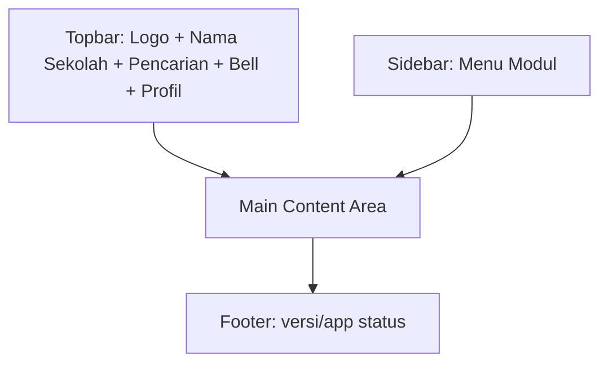

<aside>
🧩

Wireframe ini bersifat **low-fidelity** (struktur & komponen utama) untuk MVP Web Responsive.

</aside>

## 1. Site Map / Navigasi

- Dashboard
- Data Siswa
    - Daftar Siswa
    - Detail Siswa
- Pelanggaran
    - Tambah Pelanggaran
    - Riwayat Pelanggaran
- Pembinaan
    - Catatan STP2K
    - Konseling BK
- Kasus
    - Timeline Kasus
- Surat
    - Generator Surat
    - Arsip Surat
- Notifikasi
- Laporan
- Manajemen (Admin)
    - Users & Roles
    - Master Kategori Pelanggaran
    - Settings (School profile, threshold poin, nomor surat)

---

## 2. Global Layout (Desktop)



### Komponen Global

- **Topbar**
    - Search (nama/NIS)
    - Bell (notifikasi)
    - User menu (profil, logout)
- **Sidebar**
    - Menampilkan menu sesuai role (RBAC)
- **Main**
    - Breadcrumb + title halaman

---

## 3. Screen Wireframes

## 3.1 Login

```
+---------------------------------------------------+
|  Logo SMK Texmaco                                 |
|---------------------------------------------------|
|  [ Email / Username __________________________ ]   |
|  [ Password _________________________________ ]    |
|  ( ) Remember me          [ Forgot password? ]     |
|                                                   |
|              [   LOGIN   ]                        |
|                                                   |
|  Info: kontak admin jika lupa akses               |
+---------------------------------------------------+
```

---

## 3.2 Dashboard

```
+--------------------------------------------------------------------------------+
| Topbar: Search | Bell(3) | User                                                 |
+-------------------------+------------------------------------------------------+
| Sidebar                 | Dashboard                                             |
| - Dashboard             | +----------------+ +----------------+ +--------------+|
| - Data Siswa            | | Total Siswa    | | Pelanggaran hr | | Kasus aktif  ||
| - Pelanggaran           | +----------------+ +----------------+ +--------------+|
| - Pembinaan             | +--------------------------------------------------+ |
| - Kasus                 | | Grafik Tren Pelanggaran (mingguan/bulanan)        | |
| - Surat                 | +--------------------------------------------------+ |
| - Notifikasi            | +---------------------------+ +--------------------+ |
| - Laporan               | | Top Kategori Pelanggaran  | | Siswa Poin Tertinggi| |
| - (Admin) Manajemen     | +---------------------------+ +--------------------+ |
+-------------------------+------------------------------------------------------+
```

Widget minimal (MVP):

- Total siswa, total pelanggaran hari ini/bulan ini
- Kasus aktif (belum SELESAI)
- Grafik tren
- Top kategori & siswa poin tertinggi

---

## 3.3 Data Siswa — Daftar

```
+--------------------------------------------------------------------------------+
| Data Siswa                                                                     |
| [Search: Nama/NIS________] [Filter Kelas v] [Filter Jurusan v] [ + Tambah ]     |
|--------------------------------------------------------------------------------|
| Tabel:                                                                          |
| | NIS | Nama | Kelas | Jurusan | Total Poin | Status Kasus | Aksi (Detail) |     |
| |-----|------|-------|---------|------------|-------------|---------------|     |
| | ...                                                                          |
|--------------------------------------------------------------------------------|
| Pagination: < Prev  1 2 3  Next >                                               |
+--------------------------------------------------------------------------------+
```

---

## 3.4 Detail Siswa (Ringkasan + Tab)

```
+--------------------------------------------------------------------------------+
| Detail Siswa: [Nama] (NIS)                                                     |
| Kelas: XI RPL 1  | Jurusan: RPL | Orang Tua: [Nama + Kontak]                   |
|--------------------------------------------------------------------------------|
| Summary Cards: [Total Poin] [Status Kasus] [Pelanggaran Terakhir] [Surat Terakhir]|
|--------------------------------------------------------------------------------|
| Tabs: [Riwayat Pelanggaran] [Pembinaan/Konseling] [Surat] [Timeline Kasus]     |
|--------------------------------------------------------------------------------|
| (Tab content)                                                                  |
+--------------------------------------------------------------------------------+
```

### Tab: Riwayat Pelanggaran

```
| [ + Tambah Pelanggaran ]                                                       |
|--------------------------------------------------------------------------------|
| Timeline/List                                                                   |
| - (tgl) Kategori | poin | pelapor | deskripsi singkat | [Detail] [Edit] [Hapus]*|
|--------------------------------------------------------------------------------|
| *Aksi edit/hapus mengikuti RBAC & aturan waktu                                 |
```

---

## 3.5 Tambah Pelanggaran (Modal / Page)

```
+---------------------------------- Tambah Pelanggaran --------------------------+
| Siswa: [Cari nama/NIS______________ v]                                          |
| Tanggal: [ 14/06/2026  08:00 ]                                                 |
| Kategori: [Pilih kategori v]        Poin (auto): [ 10 ]                         |
| Deskripsi:                                                                      |
| [__________________________________________________________________________]    |
| Bukti (upload): [Choose file] (jpg/png/pdf)                                     |
|                                                                                 |
| [Batal]                                           [Simpan Pelanggaran]          |
+--------------------------------------------------------------------------------+
```

---

## 3.6 Kasus — Timeline Kasus (per siswa)

```
+--------------------------------------------------------------------------------+
| Kasus Siswa: [Nama]                                                            |
| Status saat ini: [ PROSES_KESISWAAN v ]   (oleh: Kesiswaan, tgl: ...)           |
|--------------------------------------------------------------------------------|
| Timeline (chronological):                                                      |
| (tgl) Pelanggaran dicatat: kategori, poin, pelapor                             |
| (tgl) Pembinaan STP2K: catatan ...                                             |
| (tgl) Konseling BK: catatan ...                                                |
| (tgl) Status berubah: dari A -> B (auto/manual)                                |
| (tgl) Surat dibuat: SP1 #001/...                                               |
|--------------------------------------------------------------------------------|
| Panel kanan (opsional):                                                        |
| - Ringkasan poin per kategori                                                   |
| - Tombol: [Tambah Catatan STP2K] [Tambah Konseling BK] [Generate Surat]        |
+--------------------------------------------------------------------------------+
```

---

## 3.7 Pembinaan / Konseling (Form Catatan)

```
+------------------------------ Tambah Catatan Pembinaan/Konseling --------------+
| Jenis: ( ) STP2K  ( ) BK                                                       |
| Siswa: (auto dari konteks)                                                     |
| Tanggal: [ ... ]                                                               |
| Catatan:                                                                       |
| [__________________________________________________________________________]    |
| Tindak lanjut (opsional):                                                      |
| [__________________________________________________________________________]    |
| Lampiran (opsional): [Choose file]                                             |
|                                                                                |
| [Batal]                                              [Simpan Catatan]          |
+--------------------------------------------------------------------------------+
```

---

## 3.8 Surat — Generator Surat

```
+--------------------------------------------------------------------------------+
| Generator Surat                                                                |
| Siswa: [Cari nama/NIS______________ v]                                         |
| Jenis Surat: [ SP1 v ] [SP2] [SP3] [Perjanjian] [Panggilan OT] [Lainnya]       |
| Template: [Default v]                                                          |
|--------------------------------------------------------------------------------|
| Preview (read-only)                                                            |
| +----------------------------------------------------------------------------+ |
| | Header sekolah + nomor surat (auto)                                        | |
| | Isi surat (merge fields: nama siswa, orang tua, kronologi, poin, dst.)     | |
| +----------------------------------------------------------------------------+ |
|--------------------------------------------------------------------------------|
| [Simpan Draft]   [Finalisasi]   [Export PDF]   [Kirim Notifikasi]              |
+--------------------------------------------------------------------------------+
```

---

## 3.9 Surat — Arsip Surat

```
+--------------------------------------------------------------------------------+
| Arsip Surat                                                                    |
| [Search siswa/nomor surat____] [Filter jenis v] [Filter status v] [Tanggal v]  |
|--------------------------------------------------------------------------------|
| | Nomor | Jenis | Siswa | Tgl | Status (Draft/Final) | Dibuat oleh | Aksi |     |
| |------|------|------|-----|------------------------|-----------|------|      |
| | ...                                                                          |
+--------------------------------------------------------------------------------+
```

---

## 3.10 Notifikasi (In-app)

```
+--------------------------------------------------------------------------------+
| Notifikasi                                                                     |
|--------------------------------------------------------------------------------|
| [Unread only] (toggle)                                                         |
| - (baru) Pelanggaran baru: [Nama] kategori [X] (+10 poin) [Lihat] [Tandai baca]|
| - Status kasus berubah: [Nama] dari A->B [Lihat timeline]                      |
| - Surat dibuat: SP1 #001/... [Unduh]                                           |
+--------------------------------------------------------------------------------+
```

---

## 3.11 Laporan

```
+--------------------------------------------------------------------------------+
| Laporan                                                                        |
| Periode: [Tanggal mulai] - [Tanggal akhir]                                     |
| Jenis: ( ) Harian ( ) Bulanan ( ) Semester                                     |
| Filter: [Kelas v] [Jurusan v] [Kategori v]                                     |
|--------------------------------------------------------------------------------|
| Preview Table/Chart                                                            |
|--------------------------------------------------------------------------------|
| [Export PDF]   [Export Excel]                                                  |
+--------------------------------------------------------------------------------+
```

---

## 4. Responsive Notes (Mobile)

- Sidebar berubah menjadi **hamburger menu**.
- Tabel panjang menjadi **card list**.
- Form input memakai layout 1 kolom.

---

## 5. Daftar Komponen UI (Shadcn/Tailwind)

- Navbar / Sidebar / Breadcrumb
- Card (stat)
- Table + Pagination
- Tabs
- Modal / Drawer
- Form: Select, Combobox (search siswa), Date picker, Textarea, File upload
- Timeline component
- Badge/Status pill
- Toast/Alert

---

## 6. Open Items untuk Iterasi Wireframe Berikutnya

- Final keputusan **WhatsApp** (MVP vs Phase 2) untuk menentukan tombol/flow “Kirim WA”.
- Aturan final **edit/hapus** pelanggaran (mempengaruhi visibilitas tombol).
- Mapping threshold poin → status (mempengaruhi automation & messaging di UI).
